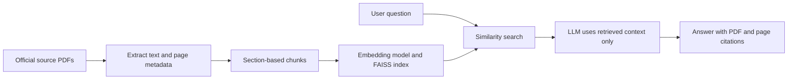

# Cloud-Native Containerization Knowledgebase

## 1. Project name

**Cloud-Native Containerization Knowledgebase**

> Note: The Azure service is named **Azure Container Registry (ACR)**, not "Container App Registry".

## 2. Business details

This solution helps developers, students, and IT professionals learn containerization and solve common Docker and Azure container-platform questions. A user asks a question in natural language, such as how to build a Docker image, push it to Azure Container Registry, deploy it to Azure Container Apps, or schedule a finite task with Azure Container Apps Jobs.

The application retrieves the most relevant passages from an approved set of Docker and Microsoft Azure documentation PDFs. It then uses the LLM to generate a concise, grounded answer with the source document name and page number. This reduces time spent manually searching lengthy technical documentation and prevents unsupported, generic answers.

## 3. Objective

Build a PDF-based RAG knowledgebase that provides accurate, source-cited guidance across the container lifecycle:

**Application code -> Docker image -> Azure Container Registry -> Azure Container Apps or Azure Container Apps Jobs**

## 4. Target users

- Developers learning or using Docker
- Students learning cloud-native development
- DevOps beginners
- IT professionals deploying containerised applications to Azure

## 5. In-scope knowledge

| Area | Covered topics |
|---|---|
| Docker fundamentals | Containers, images, Dockerfile, image layers, build, run, tags, ports, environment variables |
| Docker operations | Logs, container lifecycle, debugging, volumes, networking, image optimisation |
| Azure Container Registry | Repositories, image tags, push/pull, authentication, private images, ACR Tasks |
| Azure Container Apps | Deployment, containers, ingress, secrets, environment variables, scaling, revisions, traffic splitting, logging |
| Azure Container Apps Jobs | Manual, scheduled, and event-driven jobs; executions; finite/batch workloads |
| Security and best practices | Small trusted base images, secrets, managed identity, least privilege, image hygiene |

## 6. Out of scope for version 1

- Kubernetes and AKS
- Terraform and infrastructure-as-code generation
- CI/CD integrations
- Live web search
- Authentication and role-based access
- Multi-agent orchestration
- Automatic deployment or code changes

Keeping these outside version 1 ensures the knowledgebase is complete and reliable within the two-day delivery window.

## 7. Functional requirements

1. Accept a natural-language question through a simple chat interface.
2. Search only the approved PDF knowledge base.
3. Retrieve the most relevant document chunks using embeddings.
4. Generate an answer only from the retrieved context.
5. Display the source PDF name and page number for the answer.
6. Return a clear fallback when the documents do not contain enough evidence.
7. Cover Docker, ACR, Azure Container Apps, and Container Apps Jobs queries.

### Required fallback

> I could not find sufficient information in the available knowledgebase to answer this reliably. Please refine the question or consult the linked official documentation.

## 8. Non-functional requirements

- Answers must be concise and technically accurate.
- The system must not fabricate commands, Azure features, or citations.
- Retrieval results should include document metadata and page number.
- The application should run locally for demonstration.
- Source documents must be vendor-authoritative and stored as PDFs before indexing.

## 9. Recommended technical stack

| Component | Choice |
|---|---|
| Language | Python 3.11+ |
| UI | Streamlit |
| PDF extraction | PyMuPDF (`fitz`) |
| Embedding model | Provided embedding model |
| Vector store | FAISS |
| Answer generation | Provided LLM |
| Configuration | `.env` file for model endpoint/key details |

## 10. RAG workflow



### Ingestion approach

1. Extract each PDF page while retaining its page number.
2. Split content by heading/section where possible.
3. Use chunks of about 500-700 tokens with a small overlap.
4. Save metadata with every chunk:

```text
source_file | source_url | module | topic | page_number
```

5. Create embeddings and store them in FAISS.

### Retrieval and generation approach

1. Convert the user question into an embedding.
2. Retrieve the top 4-5 relevant chunks.
3. Pass those chunks, their source names, and page numbers to the LLM.
4. Instruct the LLM to answer only from the provided context.
5. Display sources beneath the answer.

## 11. PDF knowledge corpus

Use **nine focused PDFs**. Do not depend on one large, potentially outdated e-book. For pages that are official web documentation, use **Print -> Save as PDF**, retain the original URL in the filename or first page, and record the collection date.

| Priority | Local PDF name | Content to include | Official source |
|---:|---|---|---|
| 1 | `01_Docker_Fundamentals_and_Dockerfile.pdf` | Containers, images, Dockerfile basics, building and running images | [Docker core concepts](https://docs.docker.com/get-started/docker-concepts/the-basics/what-is-a-container/) and [Writing a Dockerfile](https://docs.docker.com/get-started/docker-concepts/building-images/writing-a-dockerfile/) |
| 2 | `02_Docker_Images_Containers_and_CLI.pdf` | Commands for images, containers, ports, lifecycle, inspect, logs | [Official Docker CLI cheat sheet PDF](https://docs.docker.com/get-started/docker_cheatsheet.pdf) |
| 3 | `03_Docker_Build_Best_Practices.pdf` | Trusted base images, smaller images, ephemeral containers, build quality | [Docker build best practices](https://docs.docker.com/build/building/best-practices/) |
| 4 | `04_Docker_Networking_and_Volumes.pdf` | Networks, port exposure, volumes, persistence | [Docker networking](https://docs.docker.com/engine/network/) and [Docker volumes](https://docs.docker.com/engine/storage/volumes/) |
| 5 | `05_Azure_Container_Registry.pdf` | ACR purpose, repositories, tags, authentication, push/pull, ACR Tasks | [ACR overview](https://learn.microsoft.com/en-us/azure/container-registry/container-registry-intro), [ACR authentication](https://learn.microsoft.com/en-us/azure/container-registry/container-registry-authentication), and [ACR Tasks](https://learn.microsoft.com/en-us/azure/container-registry/container-registry-tasks-overview) |
| 6 | `06_Azure_Container_Apps_Core.pdf` | What ACA is, supported container images, application deployment | [Azure Container Apps overview](https://learn.microsoft.com/en-us/azure/container-apps/overview) and [Containers in ACA](https://learn.microsoft.com/en-us/azure/container-apps/containers) |
| 7 | `07_Azure_Container_Apps_Configuration.pdf` | Ingress, secrets, environment variables, scaling, revisions and traffic | [Ingress](https://learn.microsoft.com/en-us/azure/container-apps/ingress-overview), [secrets](https://learn.microsoft.com/en-us/azure/container-apps/manage-secrets), [scaling](https://learn.microsoft.com/en-us/azure/container-apps/scale-app), and [revisions](https://learn.microsoft.com/en-us/azure/container-apps/revisions) |
| 8 | `08_Azure_Container_Apps_Jobs.pdf` | Manual, scheduled, event-driven jobs; job executions and suitable workloads | [Azure Container Apps Jobs](https://learn.microsoft.com/en-us/azure/container-apps/jobs) |
| 9 | `09_Azure_Container_Apps_Operations.pdf` | Logs, monitoring, troubleshooting, deployment problems, rollback guidance | [ACA log streaming](https://learn.microsoft.com/en-us/azure/container-apps/log-streaming) and the relevant troubleshooting documentation |

### Corpus rules

- Start with the nine PDFs above; target roughly 80-120 pages in total.
- Use Docker and Microsoft documentation as the primary sources.
- Avoid third-party tutorials, copied books, and legacy Azure Container Service material.
- Add each source URL and a collection date to the PDF metadata or a companion `sources.md` file.
- Rebuild the index after adding or replacing a PDF.

## 12. Example questions for the demonstration

| Question | Expected source area |
|---|---|
| What is the difference between a Docker image and a container? | Docker fundamentals |
| Why does my Docker container stop immediately? | Docker operations and logs |
| How do I make data persist after a container restarts? | Docker volumes |
| How do I push an image to Azure Container Registry? | ACR |
| How can a Container App pull a private image from ACR? | ACR authentication and ACA deployment |
| How do I store database credentials securely in Azure Container Apps? | ACA secrets |
| How do revisions and traffic splitting work in Container Apps? | ACA revisions |
| When should I use Container Apps Jobs instead of Container Apps? | ACA Jobs |
| How do I schedule a batch workload with Container Apps Jobs? | ACA Jobs |
| Why is my Container App not receiving HTTP traffic? | ACA ingress and operations |

## 13. Two-day execution plan

| Day | Activities | Deliverable |
|---|---|---|
| Day 1 | Finalise and save the nine PDFs; extract page text; chunk content; attach metadata; generate embeddings; build the FAISS index; test retrieval with 8-10 queries | Working document-ingestion and retrieval pipeline |
| Day 2 | Create grounded-answer prompt; add citations and fallback behaviour; build Streamlit interface; test 15-20 questions; capture screenshots; complete project documentation | Working local RAG application and submission documentation |

## 14. Completion criteria

The project is complete when it can:

- Answer Docker, ACR, ACA, and ACA Jobs questions through the chat interface.
- Retrieve relevant content from the local PDF corpus.
- Show the source PDF name and page number for each answer.
- Refuse or use the fallback when evidence is absent.
- Run locally and support a short live demonstration.

## 15. Suggested answer format in the application

```text
Answer
<Concise, practical answer based only on retrieved content>

Recommended steps
1. ...
2. ...

Sources
- 07_Azure_Container_Apps_Configuration.pdf, page 4
- 06_Azure_Container_Apps_Core.pdf, page 2
```

## 16. Template-ready summary

### Name of Project

Cloud-Native Containerization Knowledgebase

### Business Details about Project

This solution helps developers, students, and IT professionals understand Docker containerization and Azure container services. Users can ask questions about Docker images, containers, Dockerfiles, networking, volumes, Azure Container Registry, Azure Container Apps, and Azure Container Apps Jobs. The solution retrieves relevant content from approved Docker and Microsoft Azure documentation PDFs and provides accurate, context-based guidance with source citations.

### Technical Details about Project

The solution uses Retrieval-Augmented Generation. PDF documents are extracted with page-level metadata, split into meaningful chunks, converted into embeddings, and stored in FAISS. When a user asks a question, the system retrieves the most relevant chunks and sends them to the LLM as context. The LLM generates an answer only from that context and returns the document name and page number as citations. The application is built in Python with Streamlit, PyMuPDF, FAISS, the provided embedding model, and the provided LLM.